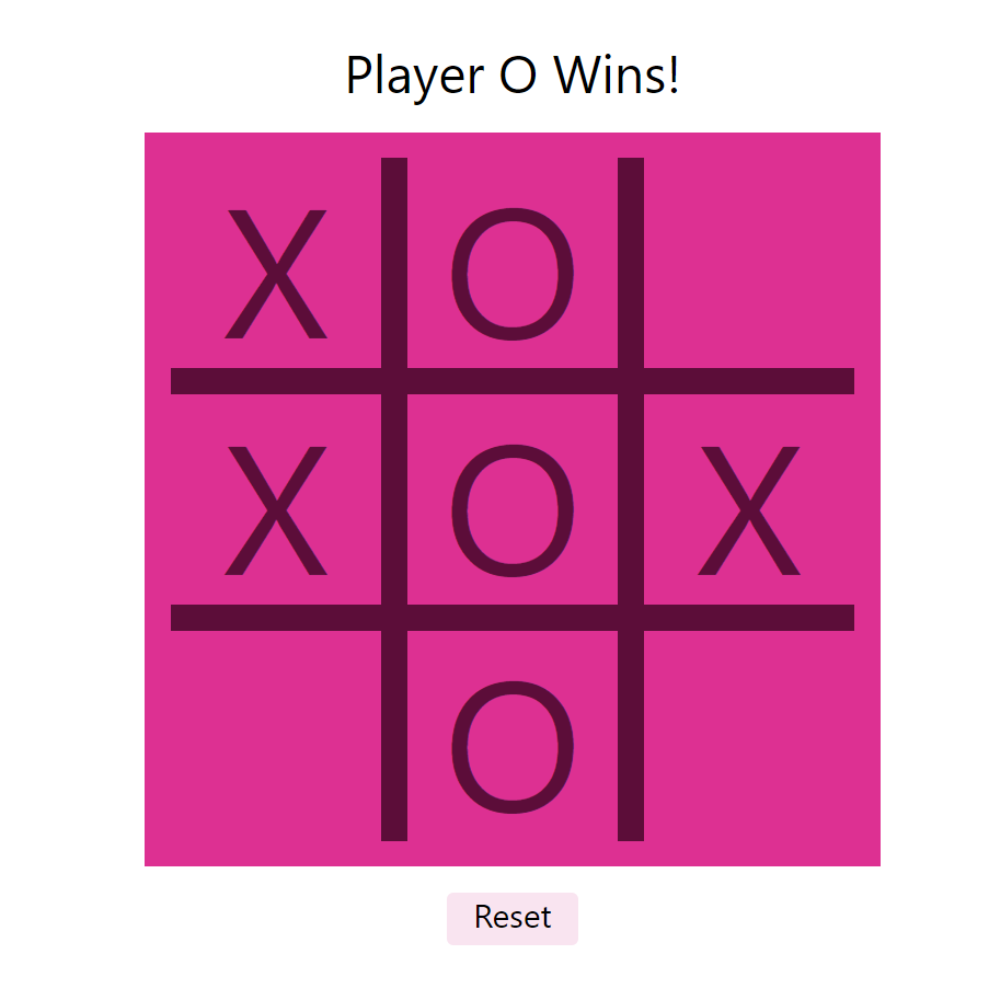

# tic-tac-toe Game

### Users are able to:

- Click on an empty space to mark it
- Win when they mark 3 spaces in a row
- Draw when all spaces are full and there is no winner
- Reset the board at any time

The gameboard:

Result: Player wins:

Result: Draw

